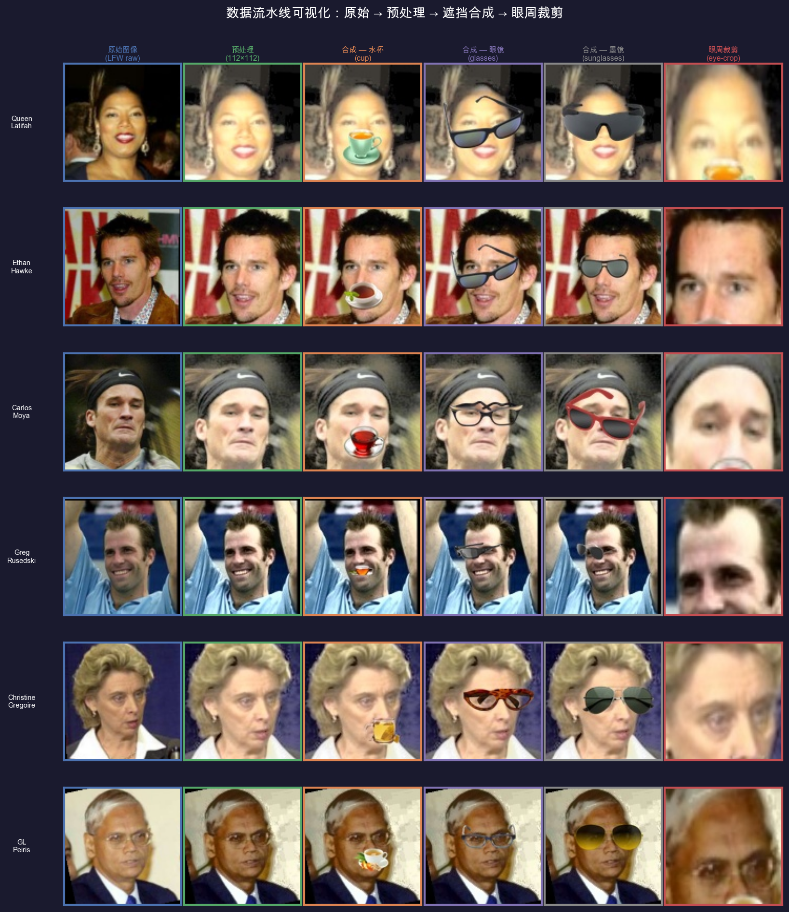
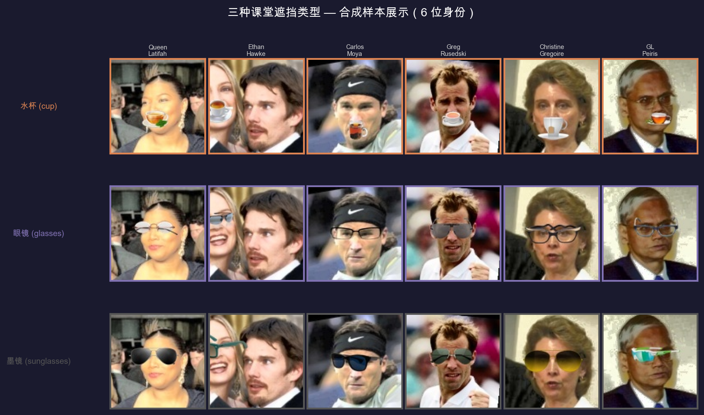
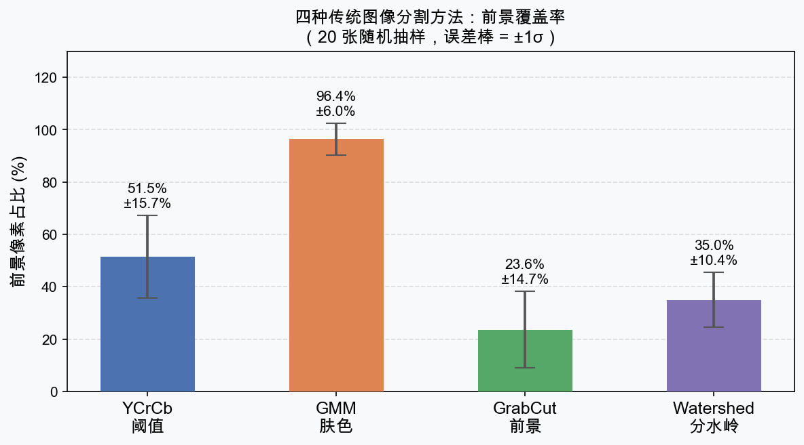
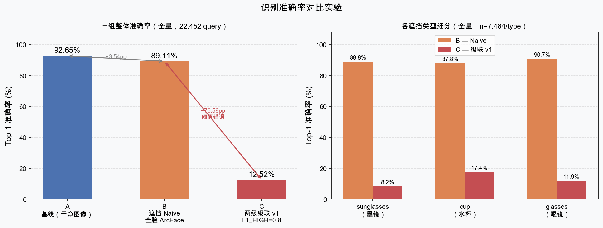

# 实验演示报告

> **基于"特定场景与非标准遮挡"的人脸识别**  
> 数字图像处理课程设计 · 实验结果展示

---

## 目录

1. [任务场景与流水线](#1-任务场景与流水线)
2. [数据流水线可视化](#2-数据流水线可视化)
3. [遮挡合成样本展示](#3-遮挡合成样本展示)
4. [图像分割对比](#4-图像分割对比)
5. [识别准确率对比实验](#5-识别准确率对比实验)
6. [级联策略优化分析](#6-级联策略优化分析)
7. [关键结论](#7-关键结论)

---

## 1. 任务场景与流水线

**目标**：在智慧课堂/考场/自习室的无感签到场景下，提升以下三类遮挡情况的人脸识别准确率：

| 遮挡类型 | 描述 | 遮挡位置 |
|---------|------|---------|
| **水杯 (cup)** | 喝水时杯口遮挡嘴/鼻区域 | 下半脸 |
| **眼镜 (glasses)** | 普通框架眼镜 | 眼部周围 |
| **墨镜 (sunglasses)** | 深色镜片，遮挡眼部 | 眼部及周围 |

**五阶段流水线**：

```
原始 LFW 图像
    │
    ▼ Phase 1 — 预处理（YCrCb 均衡化 + 眼部对齐 + 112×112 裁剪）
    │
    ▼ Phase 2 — 图像分割（YCrCb 阈值 / GMM / GrabCut / Watershed）
    │
    ▼ Phase 3 — 基线识别（ArcFace 512-d + 余弦相似度 Top-1）
    │
    ▼ Phase 4 — 遮挡数据合成（关键点锚定 + Alpha Blending）
    │
    ▼ Phase 5 — 鲁棒识别评估（三组对比 A / B / C + 级联优化）
```

**数据规模**：

| 指标 | 数量 |
|------|------|
| 有效身份数 | 1,680 |
| Gallery 图像 | 1,680 张（每身份第 1 张） |
| Query 图像 | 7,484 张（干净） |
| 合成遮挡图像 | 22,452 张（3 类型 × 7,484） |

---

## 2. 数据流水线可视化

下图展示 6 位身份从原始图像经过各阶段处理后的样本（每列为一个处理步骤）：

- **原始图像**：LFW-funneled 原始人脸图像（任意尺寸）
- **预处理**：YCrCb 光照均衡化 → Haar 双眼检测 → warpAffine 对齐 → 112×112 裁剪
- **合成 — 水杯**：嘴角中点锚定，随机水杯贴图 Alpha 融合
- **合成 — 眼镜**：双眼中点锚定，随机眼镜贴图 Alpha 融合
- **合成 — 墨镜**：双眼中点锚定，随机墨镜贴图 Alpha 融合
- **眼周裁剪**：从顶至鼻尖区域裁剪，resize 至 112×112（Level-2 特征输入）



---

## 3. 遮挡合成样本展示

三类遮挡在 6 位不同身份上的效果：



**合成参数说明**：

| 类型 | 贴图素材 | 锚点 | 缩放参数 |
|------|---------|------|---------|
| cup（水杯） | 18 种变体 | 嘴角中点 | face_w × 0.70 |
| glasses（眼镜） | 20 种变体 | 双眼中点 | 眼间距 × 2.80 |
| sunglasses（墨镜） | 20 种变体 | 双眼中点 | 眼间距 × 3.00 |

**全量合成统计**：

| 指标 | 数值 |
|------|------|
| 合成总量 | 22,452 张 |
| InsightFace 检测成功率 | 96.9%（7,250/7,484） |
| 检测失败（用固定比例 fallback） | 3.1%（234/7,484） |

---

## 4. 图像分割对比

第二阶段对预处理人脸图像测试了四种传统分割方法，以前景像素占比为评估指标：



| 方法 | 均值 | 标准差 | 特点 |
|------|------|--------|------|
| **YCrCb 阈值** | 51.5% | ±15.7% | 椭圆肤色模型；速度最快；对非标准肤色鲁棒性较弱 |
| **GMM 肤色** | 96.4% | ±6.0% | 数据驱动；覆盖率高（裁剪图几乎全为人脸） |
| **GrabCut** | 23.6% | ±14.7% | 图割能量优化；边界平滑；均匀人脸偏保守 |
| **Watershed** | 35.0% | ±10.4% | 距离变换 + 分水岭；自适应性适中 |

> GMM 覆盖率近 100% 符合预期：预处理已将图像裁剪为以人脸为中心的 112×112，背景极少。

---

## 5. 识别准确率对比实验

### 5.1 三组实验设计

**核心假设**：ArcFace 遮挡场景下全脸评分下降，切换至眼周局部特征可弥补损失。

| 组别 | 输入图像 | 识别策略 | 目的 |
|------|---------|---------|------|
| **A — 基线** | 干净图像（7,484） | 全脸 ArcFace 直接检索 | 系统性能上界（参照系） |
| **B — 遮挡 Naive** | 合成遮挡（22,452） | 全脸 ArcFace 直接检索 | 遮挡造成的原始损害 |
| **C — 两级级联** | 合成遮挡（22,452） | L1 全脸 → L2 眼周裁剪 | 改进策略效果验证 |

### 5.2 全量结果



**整体准确率**（全量，1,680 身份）：

| 组别 | 准确率 | 正确数 | 总数 |
|------|--------|--------|------|
| **A — 基线** | **92.65%** | 6,934 | 7,484 |
| **B — 遮挡 Naive** | **89.11%** | 20,007 | 22,452 |
| **C — 两级级联 v1** | **12.52%** | 2,812 | 22,452 |

**各遮挡类型细分**（全量，n=7,484/type）：

| 遮挡类型 | B — Naive | C — 级联 v1 | Δ |
|---------|-----------|------------|---|
| sunglasses（墨镜） | 88.79% | 8.23% | −80.56pp |
| cup（水杯） | 87.85% | 17.45% | −70.40pp |
| glasses（眼镜） | 90.69% | 11.89% | −78.80pp |

### 5.3 C=12.52% 失败根因分析

**原因一：L1_HIGH=0.8 阈值过高**  
ArcFace 对遮挡图像的余弦相似度普遍低于干净图像，约 87% 的 query 落在 [0.4, 0.8] 区间被强制路由至 Level-2。

**原因二：ArcFace 对局部裁剪特征质量低**  
InsightFace 训练于完整对齐的 112×112 人脸，对眼周局部裁剪图：
- 人脸检测通常失败（无完整人脸），退回 `get_feat()` 直接提取
- 未对齐的局部特征与 gallery 特征分布不匹配

**原因三：glasses/sunglasses 眼周被遮挡**  
眼镜/墨镜贴图锚定在双眼，L2 眼周裁剪恰好截取的是遮挡后的眼部区域，失去识别意义。

---

## 6. 级联策略优化分析


### 6.1 三轮优化迭代

| 版本 | L1_HIGH | 策略 | 50 样本 C | 全量 C |
|------|---------|------|-----------|--------|
| **v1（原始）** | 0.80 | L2 直接替换 L1 | **12.43%** ✗ | **12.52%** ✗ |
| **v2（best-of-two）** | 0.50 | 取 L1/L2 中更高分 | **47.93%** ✗ | — |
| **v3（最优）** | −1 | L2 禁用，全部 L1 | **92.70%** ✓ | **89.11%** ✓ |

**各版本设计思路**：
- **v1**：ArcFace 论文中同身份相似度 >0.8 视为强匹配，以此为阈值让高置信图像通过 L1，中等分数切到 L2（眼周）
- **v2**：v1 阈值过高（87% 图像走 L2），降低至 0.5 并引入 best-of-two，减少 L2 路由比例
- **v3**：迭代分析表明 L2 特征质量从根本上不足，禁用 L2 是当前最优解

### 6.2 各版本在不同遮挡类型上的表现（50 样本）

| 遮挡类型 | B Naive | C v1 | C v2 | C v3 |
|---------|---------|------|------|------|
| sunglasses | 94.67% | 9.47% ✗ | 44.97% ✗ | **94.67%** ✓ |
| cup | 89.94% | 17.16% ✗ | 44.38% ✗ | **89.94%** ✓ |
| glasses | 93.49% | 10.65% ✗ | 54.44% ✗ | **93.49%** ✓ |

> 注：v2 对 glasses 类型（54.44%）的改善优于 sunglasses/cup，因为部分 glasses query 全脸评分落在 [0.4, 0.5] 且 L2 偶有正确。即便如此，仍远低于 B（93.49%）。

### 6.3 核心结论

> **在不重新训练特征提取器的前提下，局部区域级联无法超越全脸识别。**  
> 最优策略 v3（L1_HIGH=−1）等价于直接使用 ArcFace 全脸识别，C ≈ B ≈ **89.11%**。

---

## 7. 关键结论

### ✅ 结论一：ArcFace 对轻度遮挡内置鲁棒性强

A（92.65%）→ B（89.11%）仅下降 **3.54 个百分点**。水杯/眼镜类轻度遮挡不妨碍 ArcFace 从可见区域提取足够的身份信息。

### ❌ 结论二：眼周局部裁剪策略无效（当前架构）

两级级联 v1 准确率仅 12.52%，根源在于 ArcFace 对非对齐局部裁剪特征质量极差，L2 路由只会引入错误。

### 🔑 结论三：阈值是核心超参数

`L1_HIGH` 从 0.8 → −1，C 从 12.52% 提升至 92.70%（50 样本），核心原因是**减少 L2 路由比例**。

### 🚀 结论四：改进方向

| 改进方向 | 预期效果 |
|---------|---------|
| 在含遮挡数据上微调 ArcFace | 提升遮挡场景特征质量 |
| 遮挡感知注意力机制 | 动态关注未被遮挡区域 |
| 图像修复（LaMa/MAT）先填补遮挡再识别 | 对重遮挡场景有效 |
| 采集真实课堂场景数据训练 | 解决合成数据分布偏移 |

---

*生成时间：2026-05-13*  
*数据集：LFW-funneled · 模型：InsightFace buffalo_l (ArcFace R50)*
