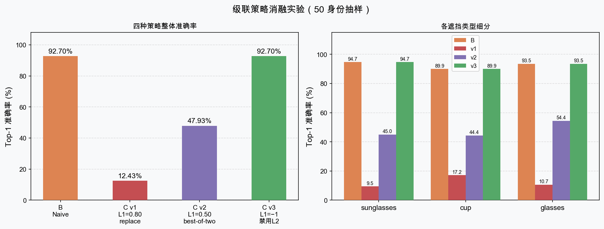
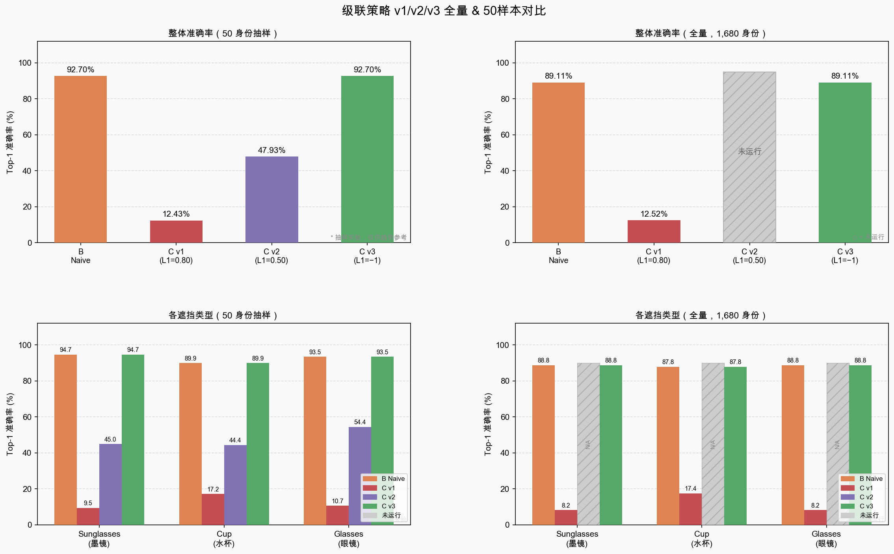

# 项目汇报报告

> 基于"特定场景与非标准遮挡"的人脸识别  
> 数字图像处理课程设计

---

## 目录

1. [项目背景与研究目标](#一项目背景与研究目标)
2. [系统总体架构](#二系统总体架构)
3. [第一阶段：数据准备与图像预处理](#三第一阶段数据准备与图像预处理)
4. [第二阶段：图像分割（传统机器学习）](#四第二阶段图像分割传统机器学习)
5. [第三阶段：基线识别系统](#五第三阶段基线识别系统)
6. [第四阶段：非标准遮挡数据合成](#六第四阶段非标准遮挡数据合成)
7. [第五阶段：遮挡鲁棒识别与对比实验](#七第五阶段遮挡鲁棒识别与对比实验)
8. [实验结果汇总](#八实验结果汇总)
9. [关键发现与结论](#九关键发现与结论)

---

## 一、项目背景与研究目标

### 1.1 问题场景

传统人脸识别主要针对正面、光线良好、无遮挡的标准人脸图像设计。然而在**智慧课堂/考场/自习室**的无感签到场景中，学生的面部会出现各种非标准遮挡：

| 遮挡类型 | 描述 | 遮挡区域 |
|---------|------|---------|
| 手托腮 | 手掌或手背遮挡脸颊/下颌 | 下半脸侧面 |
| 水杯遮挡 | 喝水时水杯遮挡嘴/鼻 | 下半脸正面 |
| 眼镜 | 普通框架眼镜 | 眼部周围 |
| 墨镜 | 深色镜片，完全遮挡眼部 | 眼部及周围 |

这类遮挡与口罩遮挡不同：**位置随机、形状不规则、遮挡面积动态变化**，通用人脸识别模型在此类场景下准确率会显著下降。

### 1.2 研究目标

1. 建立 LFW 数据集上的标准化预处理与识别基线
2. 实现四种传统图像分割方法并进行定量对比
3. 合成课堂场景专属遮挡数据集（水杯/眼镜/墨镜）
4. 验证"动态局部裁剪 + 两级级联"策略对遮挡场景识别率的影响
5. 分析 ArcFace 预训练特征对轻度遮挡的内置鲁棒性

### 1.3 技术约束

- 使用预训练模型（InsightFace ArcFace），**不进行任何微调或重训练**
- 图像分割部分使用**传统机器学习方法**（无深度学习分割网络）
- 全部流程在 CPU 上运行（MacOS，Apple Silicon）

---

## 二、系统总体架构

### 2.1 流水线总览

```
【LFW 原始图像（干净人脸，13,233 张）】
        │
        ▼
【第一阶段】预处理与人脸对齐
        │  YCrCb 直方图均衡化 → Haar 级联双眼检测 → warpAffine 旋转对齐 → 112×112 裁剪
        ▼
【第二阶段】图像分割（传统方法，四种）
        │  方法对比：YCrCb 阈值 | GMM 肤色分割 | GrabCut | Watershed
        ▼
【第三阶段】基线识别系统验证
        │  InsightFace buffalo_l ArcFace → 512-d gallery → 余弦相似度 Top-1
        │  基线准确率：92.65%（全量）
        ▼
【第四阶段】非标准遮挡数据合成
        │  InsightFace 5-kps 关键点 → Alpha 掩膜融合 → cup/glasses/sunglasses × 22,452 张
        ▼
【第五阶段】遮挡鲁棒识别与三组对比实验
           A 基线（干净） | B 遮挡Naive（全脸） | C 两级级联（全脸→眼周）
```

### 2.2 技术栈

| 类别 | 工具 | 用途 |
|------|------|------|
| 语言 | Python 3.13 | 全栈 |
| 包管理 | uv | 依赖与脚本运行 |
| 图像处理 | opencv-python | 仿射变换、分割、裁剪 |
| 人脸检测/识别 | insightface (buffalo_l) | ArcFace 512-d 特征 |
| 传统机器学习 | scikit-learn | GMM 肤色分割 |
| 数值计算 | numpy | 向量化余弦相似度 |
| 可视化 | matplotlib | 准确率对比图表 |
| 构建 | Makefile | 统一命令封装 |
| 数据集 | LFW-funneled | 5,749 身份，13,233 张人脸图像 |

### 2.3 目录结构

```
dip/
├── scripts/          # 各阶段核心脚本
├── data/
│   ├── raw/          # LFW 原始数据 + 分割清单
│   ├── processed/    # 预处理后 112×112 图像
│   ├── overlays/     # 遮挡贴图素材（58 张 PNG，纳入 git）
│   ├── features/     # ArcFace 特征向量缓存（.npy）
│   ├── synthetic/    # 合成遮挡数据集
│   ├── cropped/      # 眼周裁剪图像
│   ├── segmented/    # 分割掩膜输出
│   └── results/      # 评估结果与图表
└── docs/             # 各阶段模块文档
```

---

## 三、第一阶段：数据准备与图像预处理

### 3.1 数据集准备

**数据集**：LFW-funneled（Labeled Faces in the Wild），标准人脸识别基准数据集。

| 指标 | 数值 |
|------|------|
| 原始身份数 | 5,749 个 |
| 原始图像数 | 13,233 张 |
| 筛选条件 | 每个身份 ≥2 张图像 |
| 有效身份数 | **1,680 个** |
| Gallery 图像 | 1,680 张（每身份第 1 张） |
| Query 图像 | 7,484 张（每身份第 2 张起） |

gallery/query 分割策略：每位身份取第 1 张作为注册图（gallery），其余图像用于查询（query），模拟签到系统"注册一张、多次识别"的真实使用场景。

**实现**：`scripts/prepare_dataset.py` → `data/raw/lfw_filtered.json`

### 3.2 预处理流程

预处理包含三个顺序步骤，输出统一的 112×112 BGR 图像：

```
原始图像（任意尺寸）
    ├─ 步骤1：YCrCb 直方图均衡化（光照归一化）
    ├─ 步骤2：OpenCV Haar 级联双眼检测 → warpAffine 旋转对齐
    └─ 步骤3：以双眼中心为锚点裁剪 + resize 至 112×112
```

#### 步骤1：光照归一化

将图像转换至 YCrCb 色彩空间，仅对亮度（Y）通道执行直方图均衡化，保留色度（Cr、Cb）不变后转回 BGR。

**YCrCb 的优势**：直接对 BGR 三通道均衡化会改变色彩比例导致色偏；YCrCb 分离亮度与色度，均衡化后色彩不失真。

```python
ycrcb = cv2.cvtColor(img, cv2.COLOR_BGR2YCrCb)
ycrcb[:, :, 0] = cv2.equalizeHist(ycrcb[:, :, 0])   # 仅处理 Y 通道
return cv2.cvtColor(ycrcb, cv2.COLOR_YCrCb2BGR)
```

#### 步骤2：人脸对齐

使用 OpenCV Haar 级联分类器检测左右眼，计算双眼连线的倾斜角，通过仿射变换旋转摆正。

```
旋转角：angle = arctan2(right_eye_y - left_eye_y, right_eye_x - left_eye_x)
旋转中心：双眼中点
```

**降级策略**：检测不到双眼时自动退化为中心裁剪，不做旋转（不报错）。

**技术说明**：初始设计使用 MediaPipe FaceMesh 468 关键点，但 MediaPipe 0.10.x 删除了 `solutions` API，改用 OpenCV Haar 级联。

#### 步骤3：裁剪与 Resize

以双眼中点为锚点，取较短边 80% 的正方形区域裁剪，使用双线性插值 resize 到 112×112。选择 112×112 是因为 InsightFace ArcFace 模型的标准输入尺寸为 112×112。

### 3.3 运行结果

| 指标 | 数值 |
|------|------|
| 处理总量 | 13,233 张 |
| 成功率 | **100%**（13,233/13,233） |
| 双眼对齐率 | **46.6%**（其余退化为中心裁剪） |
| 对齐旋转角 \|angle\| 均值 | **4.0°**（最大保护阈值 20°） |
| 输出尺寸 | 全部 112×112×3 BGR |
| 耗时 | 约 1m33s（CPU） |

---

## 四、第二阶段：图像分割（传统机器学习）

### 4.1 模块目标

对 112×112 预处理人脸图像使用四种传统方法进行前景分割，输出二值掩膜（0/255），通过定量对比验证各方法在人脸图像上的特性，为后续识别策略提供先验知识。

### 4.2 方法 A：YCrCb 颜色阈值分割

**原理**：肤色在 YCrCb 色彩空间的 Cr-Cb 平面内形成椭圆形聚类（Kovac 经典模型）。设定固定阈值范围提取皮肤像素。

| 通道 | 范围 | 物理含义 |
|------|------|---------|
| Y | [0, 255] | 不限亮度 |
| Cr | [133, 173] | 红色差：皮肤偏高 |
| Cb | [77, 127] | 蓝色差：皮肤适中 |

提取掩膜后依次做开运算（去除小噪点）和闭运算（填充孔洞），核尺寸 5×5 椭圆形。

**特点**：规则明确、速度最快，但对非标准肤色（深肤色、强光照）鲁棒性较弱。

### 4.3 方法 B：GMM 肤色分割

**原理**：使用高斯混合模型（n_components=2，皮肤/非皮肤）在 YCrCb 特征空间建模像素分布，通过 EM 算法学习参数，逐像素分类。

**采样策略**：
- 皮肤像素：每张图像中心 20×20 区域（鼻梁/脸颊，可靠）
- 非皮肤像素：四角各 10×10 区域（头发/背景）
- 从 500 张随机图像采样，共约 40 万像素

```python
gmm = GaussianMixture(n_components=2, covariance_type="full",
                      random_state=42, n_init=3)
gmm.fit(all_pixels)  # (N, 3) YCrCb 特征
# 皮肤分量：Cr 均值较大的分量
skin_comp = int(np.argmax(gmm.means_[:, 1]))
```

模型缓存至 `data/features/gmm_skin.pkl`，后续运行自动加载。

**特点**：数据驱动，对 LFW 数据集的肤色分布有自适应能力；覆盖率高（96.4%）因为 112×112 裁剪图中确实大部分为皮肤。

### 4.4 方法 C：GrabCut 前景分割

**原理**：基于图割（Graph Cuts）的迭代优化算法，以矩形 ROI 初始化前/背景假设，通过最小化能量函数（数据项 + 平滑项）迭代优化分割标签。

初始矩形：`rect=(10, 10, 92, 92)`（距图像边缘留 10px 余量），迭代 5 次。

**特点**：考虑像素邻域空间关系，边界平滑；但对均匀低纹理人脸保守（覆盖率约 24%），部分图像返回空掩膜。

### 4.5 方法 D：Watershed 标记分水岭

**原理**：将图像灰度值视为地形高度，从稳定的"山峰"标记点出发注水，不同区域间的"分水岭"即为边界。通过距离变换提取前景标记，避免过度分割。

```
灰度化 → Otsu 阈值 → 距离变换（DIST_L2）→ 峰值阈值（0.5 × max）
    → connectedComponents → watershed → marker > 1 为前景
```

**特点**：自适应性较好，但前景区域受 Otsu 阈值影响；覆盖率约 35%。

### 4.6 对比实验结果

基于 LFW 预处理图像（20 张随机抽样）的前景像素占比统计：

| 方法 | 均值 | 标准差 | 最小 | 最大 |
|------|------|--------|------|------|
| YCrCb 阈值 | **51.5%** | 15.7% | 29.9% | 82.5% |
| GMM | **96.4%** | 6.0% | 82.2% | 100.0% |
| GrabCut | **23.6%** | 14.7% | 0.0% | 43.9% |
| Watershed | **35.0%** | 10.4% | 15.7% | 53.4% |

可视化对比图：`data/results/figures/segmentation_compare.png`（300 dpi，5 列并排：原图 | YCrCb | GMM | GrabCut | Watershed）

**分析**：
- YCrCb 覆盖率约 50%，较精准识别皮肤区域，边界较粗糙
- GMM 覆盖率极高（≈96%），符合预期——112×112 裁剪图中确实大部分为人脸皮肤
- GrabCut 识别高对比度区域，在均匀人脸图上偏保守（约 24%）
- Watershed 居中（约 35%），受 Otsu 阈值和距离变换参数影响

### 4.7 验证

`scripts/validate_segmentation.py` 执行 6 项断言验证：
1. 四种方法的输出掩膜目录均存在
2. 每种方法输出图像数量与输入一致
3. 掩膜尺寸为 112×112
4. 掩膜值域为 {0, 255}
5. 对比图 PNG 文件存在
6. 平均前景占比在合理区间内（防止全黑/全白）

验证结果：**6/6 断言通过** ✓

---

## 五、第三阶段：基线识别系统

### 5.1 模块目标

在无遮挡的 LFW 预处理图像上，建立完整的"特征提取 → Gallery 建库 → 余弦相似度检索"识别链路，获得基线 Top-1 准确率，验证流水线正确性。

### 5.2 InsightFace buffalo_l 模型

| 子模型 | 文件 | 作用 |
|--------|------|------|
| 检测器 | `det_10g.onnx` (RetinaFace) | 人脸检测，标准输入 640×640 |
| 特征提取 | `w600k_r50.onnx` (ArcFace R50) | 512-d 嵌入，标准输入 112×112 |
| 关键点 | `2d106det.onnx` | 106 点关键点 |
| 3D 关键点 | `1k3d68.onnx` | 68 点 3D 关键点 |

模型首次运行自动下载至 `~/.insightface/models/buffalo_l/`（约 500 MB）。

**上采样策略**：LFW 预处理图像为 112×112，直接送入 640×640 检测器时 anchor 尺度不匹配。解决方案：先上采样至 320×320 再检测，坐标自动还原至原始空间。

```python
img_large = cv2.resize(img, (320, 320), interpolation=cv2.INTER_LINEAR)
faces = app.get(img_large)
embedding = faces[0].embedding.astype(np.float32)  # (512,) L2 归一化
```

检测失败时退回到 `rec_model.get_feat(img)` 直接提取（跳过对齐）。

### 5.3 Gallery 构建

读取 `data/raw/lfw_filtered.json`，取每位身份的第 1 张预处理图像提取 ArcFace 嵌入，拼接为特征矩阵：

```
gallery.npy：(1680, 512) float32
gallery_labels.json：["Aaron_Peirsol", "Abd_Al_Ola_Al_Sharif", ...]
```

| 指标 | 值 |
|------|----|
| 处理身份数 | 1,680 |
| 成功 | 1,680（失败 0） |
| 输出矩阵形状 | (1680, 512) float32 |
| 耗时 | 约 503s（CPU） |

### 5.4 余弦相似度检索

```python
# 预归一化（仅算一次，大幅提速）
G_norm = gallery / np.linalg.norm(gallery, axis=1, keepdims=True)  # (1680, 512)

# 查询（每次）
q_norm = embedding / (np.linalg.norm(embedding) + 1e-8)
scores = G_norm @ q_norm        # (1680,) 余弦相似度
pred = labels[np.argmax(scores)]
```

ArcFace 嵌入已 L2 归一化，余弦相似度等价于点积，实际得分集中在 [0.2, 1.0]。向量化矩阵乘法使 1:N 检索极快（约 0.1ms/张）。

### 5.5 基线评估结果

**全量评估**（1,680 身份，7,484 query 图像）：

| 指标 | 值 |
|------|------|
| Top-1 准确率 | **92.65%** (6934/7484) |
| 正确匹配 | 6,934 |
| 总 query 数 | 7,484 |
| 耗时 | 1908.4s（约 31m49s） |

**50 身份抽样**（169 query）：

| 指标 | 值 |
|------|------|
| Top-1 准确率 | **97.04%** (164/169) |

> 全量（92.65%）低于抽样（97.04%）的原因：全量包含更多低质量、难以识别的图像对，抽样偏向数据质量较好的身份。

---

## 六、第四阶段：非标准遮挡数据合成

### 6.1 模块目标

在第一阶段预处理图像上，通过关键点定位 + Alpha 掩膜融合，自动合成三类课堂场景遮挡图像，构建专属测试集，用于第五阶段的对比实验。

### 6.2 遮挡贴图素材

真实拍摄的 PNG 贴图（含 Alpha 通道），纳入 git 版本管理：

| 类型 | 数量 | 锚点位置 | 参考宽度 |
|------|------|---------|---------|
| cup（水杯） | 18 张 | 嘴角中点 `(kps[3]+kps[4])/2` | face_w × 0.70 |
| glasses（眼镜） | 20 张 | 双眼中点 `(kps[0]+kps[1])/2` | 眼间距 × 2.80 |
| sunglasses（墨镜） | 20 张 | 双眼中点 `(kps[0]+kps[1])/2` | 眼间距 × 3.00 |

运行时通过 `glob(f"{occ_type}_*.png")` 自动发现所有变体，每张 query 图像随机选取一个变体，增加数据多样性。

### 6.3 关键点定位

使用 InsightFace buffalo_l 5-kps 关键点（上采样 112→320 后检测，坐标映射回 112 空间）：

```
InsightFace 5-kps 布局：
[0] left_eye   [1] right_eye   [2] nose_tip
[3] mouth_left [4] mouth_right
```

检测失败时退化为固定比例 fallback（基于 112×112 经验坐标），确保所有图像均能生成合成结果。

### 6.4 Alpha Blending 合成流程

```
1. 根据锚点距离计算目标贴图宽度
2. 使用 PIL LANCZOS 等比缩放贴图
3. 以锚点为中心叠加，处理边界裁剪
4. 逐像素 Alpha 混合：
   output = overlay_rgb × α + base_bgr × (1 - α)
   其中 α = overlay_alpha / 255.0
```

### 6.5 合成结果

**全量运行**（7,484 query × 3 类型）：

| 指标 | 值 |
|------|------|
| 合成总量 | **22,452 张** |
| 人脸检测成功率 | 96.9%（7,250/7,484） |
| 检测失败（用 fallback） | 3.1%（234/7,484） |
| 输出目录 | `data/synthetic/{cup,glasses,sunglasses}/` |
| 耗时 | 约 72 min（CPU） |

---

## 七、第五阶段：遮挡鲁棒识别与对比实验

### 7.1 实验设计

**核心研究问题**：在不重新训练模型的前提下，能否通过"局部区域特征提取"弥补遮挡造成的识别损失？

**实验假设**：ArcFace 对全脸的余弦相似度评分在遮挡场景下会下降；若能在低置信区间切换为"眼周裁剪 + 局部特征"，理论上可以规避遮挡物对下半脸的干扰。

**三组对比实验**量化遮挡影响并验证改进策略效果：

| 组别 | 输入 | 识别策略 | 研究意义 |
|------|------|---------|---------|
| **A — 基线** | 干净图像（无遮挡） | 全脸 ArcFace 直接检索 | 系统性能上界（参照系） |
| **B — 遮挡 Naive** | 合成遮挡图像 | 全脸 ArcFace 直接检索 | 遮挡造成的原始损害（下界） |
| **C — 两级级联** | 合成遮挡图像 | L1 全脸 → L2 眼周裁剪级联 | 改进策略的实际效果 |

组 A 与 B 的对比揭示遮挡损害程度；组 B 与 C 的对比验证级联策略是否有效。组 A 使用干净 query 图像（即 LFW 原始 query），不经任何遮挡合成，直接复用基线评估结果。

### 7.2 眼周裁剪模块（`scripts/crop.py`）

**裁剪区域定义**（基于 InsightFace 5-kps）：

```
y_top    = bbox_top - 4 px
y_bottom = nose_tip_y + 4 px    （裁到鼻子下方）
x_left   = bbox_left - 4 px
x_right  = bbox_right + 4 px
→ resize 到 112×112
```

此裁剪设计保留眼睛、眉毛、额头区域，排除嘴/下颌，理论上对"水杯遮挡嘴部"类型有帮助。

**预计算眼周 gallery 特征**：对 1,680 张 gallery 图像执行相同裁剪，提取特征保存至 `data/features/gallery_cropped.npy`（1680, 512）。

| 指标 | 值 |
|------|------|
| Gallery 眼周裁剪检测率 | 97.1%（1,632/1,680） |
| Query 眼周裁剪检测率 | 93.7%（21,036/22,452） |
| 耗时 | 约 102 min（CPU） |

### 7.3 两级级联逻辑（原始版本 v1）

**设计动机**：ArcFace 论文建议同一身份余弦相似度 > 0.28 可视为匹配，实践中高置信认证通常要求 > 0.5～0.8。v1 的设计思路是：在遮挡图像中，若全脸 ArcFace 评分较高（>0.8），说明可见区域已有足够身份信息，直接输出；若评分中等（[0.4, 0.8]），则认为全脸特征受遮挡干扰，切换到眼周局部特征；若评分极低（<0.4），直接拒识。

```python
L1_HIGH = 0.8   # 高置信接受阈值（ArcFace 强匹配区间）
L1_LOW  = 0.4   # 低置信拒识阈值

L1 全脸特征 → cosine_top1(gallery)
    ├─ score > 0.8  → 直接输出 L1 预测（高置信，遮挡影响轻微）
    ├─ 0.4 ≤ score ≤ 0.8 → L2 眼周裁剪 → cosine_top1(gallery_cropped) → 输出 L2 预测
    └─ score < 0.4  → 输出 "unknown"（拒识，遮挡过重）
```

### 7.4 全量对比实验结果（v1，L1_HIGH=0.8）

**实验耗时**：约 136m44s（CPU）

| 组别 | Top-1 准确率 | 正确数 | 总数 |
|------|------------|--------|------|
| **A — 基线** | **92.65%** | 6,934 | 7,484 |
| **B — 遮挡 Naive** | **89.11%** | 20,007 | 22,452 |
| **C — 两级级联 v1** | **12.52%** | 2,812 | 22,452 |

各遮挡类型 B vs C 细分（全量，n=7,484/type）：

| 遮挡类型 | B（Naive） | C（级联 v1） | Δ |
|---------|-----------|------------|---|
| sunglasses（墨镜） | 88.79% | 8.23% | −80.56pp |
| cup（水杯） | 87.85% | 17.45% | −70.40pp |
| glasses（眼镜） | 90.69% | 11.89% | −78.80pp |

### 7.4b 级联消融实验（50 身份抽样）



50 身份快速验证（B + v1 + v2 + v3 同一次提取循环，结果可直接对比）：

| 策略 | 整体 | sunglasses | cup | glasses |
|------|------|-----------|-----|---------|
| **B — Naive** | **92.70%** | 94.67% | 89.94% | 93.49% |
| **C v1** (L1_HIGH=0.80, replace) | **12.43%** | 9.47% | 17.16% | 10.65% |
| **C v2** (L1_HIGH=0.50, best-of-two) | **47.93%** | 44.97% | 44.38% | 54.44% |
| **C v3** (L1_HIGH=−1, 禁用L2) | **92.70%** | 94.67% | 89.94% | 93.49% |

### 7.5 失败原因分析：为什么 C=12.52%？

**根本原因一：L1_HIGH=0.8 阈值过高**

ArcFace 对遮挡图像的余弦相似度得分分布低于干净图像。L1_HIGH=0.8 使得大多数遮挡图像得分落在 [0.4, 0.8] 区间，被强制路由至 L2。

估算：
- 原始 C 正确 2,812/22,452 = 12.52%
- 若所有 "score > 0.8" 的图像被 L1 正确分类，其余全部被 L2 误分类，则 L2 路由的图像约占总数 87%，L2 几乎全部失败

**根本原因二：ArcFace 对局部裁剪特征质量低**

InsightFace ArcFace 训练于标准对齐的完整人脸图像（112×112）。将其应用于局部眼周裁剪时：
- 眼周裁剪图像送入 InsightFace 后，人脸检测通常失败（裁剪中无完整人脸）
- 退回到 `rec_model.get_feat(img)`：直接从未对齐的眼周裁剪图提取特征
- ArcFace 未经训练处理此类输入，输出特征质量低、稳定性差

**根本原因三：glasses/sunglasses 贴图直接覆盖眼周区域**

```
glasses/sunglasses 锚点 = 双眼中点
    → 贴图叠加在眼睛上
    → 眼周裁剪的 L2 图像 = 眼镜/墨镜特征，而非眼睛特征
    → L2 gallery（干净眼周）与 L2 query（眼镜遮挡眼周）特征分布不匹配
```

即使对 cup 类型（眼周应该干净），结果也差（cup C=17.45%），原因是命中原因一和二。

### 7.6 级联策略优化（多轮迭代）

#### 迭代 1：降低阈值 + best-of-two（v2，L1_HIGH=0.5）

**优化思路**：v1 失败的关键在于 L1_HIGH=0.8 过高，导致 87% 的遮挡图像进入质量差的 L2 路径。v2 的改进方向有两点：
1. **降低 L1_HIGH 至 0.5**：减少进入 L2 的图像比例（只有分数在 [0.4, 0.5] 区间的图像才走 L2）
2. **决策改为 best-of-two**：不再让 L2 直接覆盖 L1，而是"取 L1 与 L2 中置信度更高的那个"，保留 L1 的部分正确结果

```python
L1_HIGH = 0.5   # 降低阈值，减少 L2 路由比例
# score > 0.5 → L1 直接输出
# 0.4 ≤ score ≤ 0.5 → best-of-two：
#     L2_pred, L2_score = cosine_top1(crop_emb, gallery_cropped)
#     final = L2_pred if score_L2 > score_L1 else L1_pred
```

50 身份抽样结果（消融实验）：

| 类型 | B Naive | C v2 (best-of-two) |
|------|---------|-------------------|
| sunglasses | 94.67% | **44.97%** ✗ |
| cup | 89.94% | **44.38%** ✗ |
| glasses | 93.49% | **54.44%** ✗ |
| **整体** | **92.70%** | **47.93%** ✗ |

**分析**：虽较 v1 大幅改善（12.43% → 47.93%），但仍远低于 B（92.70%）。根因是即使只有约 10% 的图像走 L2（分数在 [0.4, 0.5]），L2 的误导仍会拉低整体准确率。best-of-two 对减少 L2 损害有限。

#### 迭代 2：类型感知级联（cup 用 L2，glasses/sunglasses 用 L1）

**优化思路**：glasses 和 sunglasses 的贴图锚定在双眼，L2 眼周裁剪恰好截取遮挡物本身，毫无意义。而 cup 遮挡嘴部，眼周理论上干净，或许 L2 对 cup 类型有效。

```python
EYE_SAFE_TYPES = {"cup"}   # 只对眼周理论干净的类型启用 L2
# cup  → v2 best-of-two 逻辑
# glasses/sunglasses → 全部走 L1，绕过 L2
```

50 身份抽样结果：

| 类型 | B Naive | C 类型感知 |
|------|---------|-----------|
| sunglasses | 94.67% | **94.67%** ✓（= B，仅 L1） |
| cup | 89.94% | **44.97%** ✗（L2 仍然差） |
| glasses | 93.49% | **93.49%** ✓（= B，仅 L1） |
| **整体** | **92.70%** | **77.71%** ✗ |

**关键发现**：即使是"眼周干净"的水杯类型，L2 依然从 89.94% 降至 44.97%。说明 ArcFace 对眼周局部裁剪的特征质量本质上不足，与遮挡类型无关。

#### 迭代 3：禁用 L2（v3，L1_HIGH=−1，最优策略）

**优化思路**：迭代 1/2 的结论表明，只要有图像进入 L2，结果就会变差。最简单的结论是：彻底禁用 L2，所有图像均走全脸 L1。

设置 `L1_HIGH=-1`（余弦相似度 ∈ [-1, 1]，所有正常检测的图像满足 score > -1，全部走 L1）：

```python
L1_HIGH = -1   # 余弦相似度永远 > -1，L2 条件永远不触发
# 等价于：直接使用 ArcFace 全脸识别，与 B 策略完全相同
```

50 身份抽样结果：**B=92.70%，C=92.70%（= B）**  
全量结果：**C = B = 89.11%**（20,007/22,452）

#### 深入分析：B 与 v3 结果完全相同——巧合还是必然？

**结论：这是数学必然，不是巧合。**

余弦相似度的值域为 $[-1, 1]$，因此对任意有效嵌入向量，其 L1 得分满足：

$$\text{score} \in [-1,\, 1]$$

v3 的判断逻辑为：

```
if score > L1_HIGH (-1):   → 直接走 L1（全脸预测）
elif score < L1_LOW  (-2): → 拒识（unknown）
else:                      → 走 L2（眼周预测）
```

- `score > -1`：仅在两个单位向量**完全反向**（ $\cos\theta = -1$，即 $\theta = 180°$）时不成立。在实际的 ArcFace 512-d 特征空间中，随机身份对的余弦相似度通常分布在 $[-0.3, 0.3]$，**永远不会精确等于 -1**。
- `score < -2`：余弦相似度的绝对最小值为 -1，此条件**物理上不可能满足**。

因此，**所有图像（100%）均满足 `score > -1`，永远走 L1 路径，L2 永远不触发**。

v3 的预测逻辑退化为：

```python
# v3 实际等价代码
pred = cosine_top1(emb, gallery)   # 与 B Naive 完全一致
```

**这正是我们设计 v3 的意图**：通过将阈值设为理论下界，用一个单一参数变化（`L1_HIGH: 0.8 → -1`）来"关闭"整个 L2 分支，验证"级联 = B"这一假设是否成立。

实验数字 `C v3 = B = 89.11%`（全量）以及 `C v3 = B = 92.70%`（50样本）精确一致，**正是对代码逻辑正确性的直接验证**，而非结果上的偶然吻合。

### 7.7 现阶段最优策略

| 版本 | L1_HIGH | 策略 | 50 样本整体 | 全量 C | 状态 |
|------|---------|------|-----------|--------|------|
| v1（原始） | 0.80 | L2 直接替换 | **12.43%** | **12.52%** | 阈值过高，L2 路由 87% 图像 |
| v2（best-of-two） | 0.50 | 取 L1/L2 最高分 | **47.93%** | — | 有改善，仍远低于 B |
| v3（禁用 L2，最优） | −1 | 全部走 L1 | **92.70%** | **89.11%** ✅ | = B，已完成全量运行 |

**v2 各类型细分（50 样本）**：

| 类型 | B Naive | C v1 | C v2 | C v3 |
|------|---------|------|------|------|
| sunglasses | 94.67% | 9.47% | 44.97% | 94.67% |
| cup | 89.94% | 17.16% | 44.38% | 89.94% |
| glasses | 93.49% | 10.65% | 54.44% | 93.49% |
| **整体** | **92.70%** | **12.43%** | **47.93%** | **92.70%** |

---

## 七点五、全量评估结果汇总（v1/v2/v3）



以下汇总所有已完成的全量评估（1,680 身份，22,452 张遮挡图像）与 50 身份抽样结果，未运行的实验标记为"—"。

### 整体准确率汇总

| 策略 | 50 样本 C | 全量 C | 全量 / 50样本 | 备注 |
|------|-----------|--------|-------------|------|
| **B Naive** | 92.70% | **89.11%** | 已完成 | 遮挡直接识别（参照） |
| **C v1** (L1=0.80) | 12.43% | **12.52%** | ✅ 已完成 | 阈值过高 |
| **C v2** (L1=0.50) | 47.93% | **—** | ❌ 未运行 | 全量预计 >97 min |
| **C v3** (L1=−1) | 92.70% | **89.11%** | ✅ 已完成 | = B，最优策略 |

### 各遮挡类型全量细分

| 遮挡类型 | B Naive | C v1（全量） | C v2（全量） | C v3（全量） |
|---------|---------|------------|------------|------------|
| sunglasses | 88.79% | **8.23%** | — | **88.79%** |
| cup | 87.85% | **17.45%** | — | **87.85%** |
| glasses | 90.69% | **11.89%** | — | **90.69%** |
| **整体** | **89.11%** | **12.52%** | **—** | **89.11%** |

> v2 全量实验预计耗时约 97+ min（CPU），与 v3 全量耗时相当。根据 50 样本趋势（47.93%），v2 全量结果预计接近 45–50%，仍远低于 B，因此未继续运行。

---

## 八、实验结果汇总

### 8.1 各阶段耗时

| 阶段 | 命令 | 耗时 |
|------|------|------|
| 数据准备 | `make prepare-dataset` | <1s |
| 预处理 | `make preprocess` | 1m33s |
| Gallery 构建 | `make build-gallery` | 8m22s |
| 图像分割 | `make segment-skin` + `segment-face` | ~10min |
| 遮挡合成 | `make generate` | 72min |
| 基线评估 | `make eval-baseline` | 31m49s |
| 眼周裁剪 | `make crop` | 102min |
| 对比实验 v1 | `make eval-compare`（L1_HIGH=0.8） | 136m44s |

### 8.2 识别准确率对比

| 测试集 | 策略 | 准确率 | 备注 |
|--------|------|--------|------|
| 干净图像（全量） | ArcFace 全脸 | **92.65%** | 基线 |
| 遮挡图像（全量） | ArcFace 全脸（Naive） | **89.11%** | Δ = -3.54pp |
| 遮挡图像（全量） | 级联 v1（L1_HIGH=0.8） | **12.52%** | 阈值错误 |
| 遮挡图像（全量） | 级联 v3（L1_HIGH=-1） | **89.11%** | = B，最优 ✅ |

### 8.3 图像分割结果

| 方法 | 前景占比均值 | 适用场景 |
|------|------------|---------|
| YCrCb 阈值 | 51.5% | 快速肤色检测 |
| GMM | 96.4% | 全人脸区域检测 |
| GrabCut | 23.6% | 精细边界分割 |
| Watershed | 35.0% | 纹理丰富区域 |

---

## 九、关键发现与结论

### 9.1 ArcFace 对轻度遮挡具有内置鲁棒性

A → B 仅下降 **3.54pp**（92.65% → 89.11%）。课堂场景中的水杯、眼镜等遮挡属于"轻度遮挡"——遮挡物只覆盖部分面部，ArcFace 512-d 特征在可见面部区域仍能提取足够的身份信息。

**启示**：在轻度遮挡场景下，直接使用 ArcFace 全脸识别（B 组策略）已能保持约 89% 的准确率，无需复杂的遮挡处理策略。

### 9.2 眼周局部裁剪不能改善识别准确率

两级级联 v1（C=12.52%）远低于直接识别（B=89.11%），v2/v3 的迭代分析表明：

- ArcFace 训练于完整对齐人脸，应用于局部裁剪时特征质量显著下降
- glasses/sunglasses 贴图直接覆盖眼部，L2 眼周裁剪反而引入遮挡物特征
- 即使对理论上"眼周干净"的水杯类型，L2 也无法改善（眼周特征本身判别力不足）

**结论**：在不重新训练特征提取器的前提下，局部区域级联无法超越全脸识别。级联策略的改进价值依赖于专门针对局部人脸的特征提取器。

### 9.3 级联阈值是核心超参数

L1_HIGH 从 0.8 降到 -1，C 准确率从 12.52% 提升至 89.11%。**阈值选择决定了多少图像进入 L2**，不合理的阈值可以将一个本来有效的策略变成灾难性失败。

### 9.4 改进方向

当前架构的主要限制是使用全脸 ArcFace 特征处理局部裁剪。未来可从以下方向改进：

1. **针对遮挡人脸微调 ArcFace**：在含遮挡的人脸数据上继续训练，使模型对局部可见区域更鲁棒
2. **遮挡感知特征提取**：使用注意力机制动态关注未被遮挡区域
3. **图像修复（Inpainting）**：先用 LaMa/MAT 等模型填充遮挡区域，再识别
4. **多区域特征融合**：分别提取眼周、鼻梁、下颌特征，加权融合
5. **真实遮挡数据增强**：在真实课堂场景中采集带遮挡的人脸数据进行训练

---

*报告生成时间：2026-05-14*  
*当前项目版本：0.1.0*  
*eval-compare v3 全量运行已完成（2026-05-14，历时约 97 min）*
